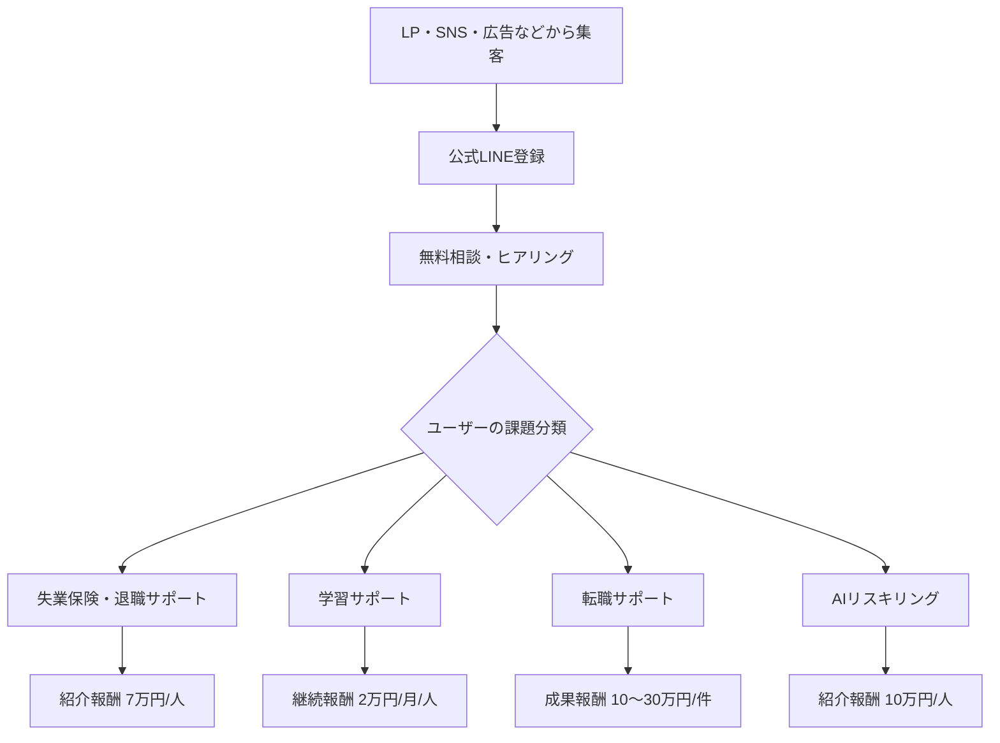

# キャリサポ LP分析・事業内容コンテキスト

## 1. 分析対象

- Web LP: `https://ogaignbr.github.io/carisapo/`
- 添付PDF: Web LPをキャプチャしたLP資料  
  - 内容はWeb LPと同一またはほぼ同一の構成として扱う
- 追加情報: 紹介・成果報酬に関する報酬条件

---

## 2. LP全体の訴求概要

キャリサポは、退職・失業保険・学習・転職・AIリスキリングを組み合わせて、ユーザーの「これからのキャリア」を支援する総合キャリアサポートサービスとして訴求されている。

メインコピーは「あなたのこれからに寄り添う。」であり、単なる転職支援ではなく、退職後の不安、生活費、学習、再就職、スキルアップまでを一気通貫でサポートする印象を作っている。

LP上では、キャリサポ利用によって「最大+473.6万円相当」のメリットが得られる可能性があることを大きく打ち出している。

---

## 3. 想定ターゲット

### 主なターゲット

- 今の仕事を辞めたいが、退職後のお金が不安な人
- 失業保険や給付金制度についてよく分からない人
- 退職後にスキルアップや学習をしたい人
- 自分に合った転職先を探したい人
- 生成AI・AIスキルなど、今後必要なスキルを身につけたい人
- ひとりでキャリアの悩みを抱えている20代〜30代

### 心理的ニーズ

- 退職後の生活費への不安を減らしたい
- 何から始めればいいか分からない状態から抜け出したい
- 制度や補助金を活用して、損をせず次のキャリアに進みたい
- 一人ではなく、伴走してくれる相談相手がほしい
- 仕事だけではなく、人生全体を立て直したい

---

## 4. 事業内容の要約

キャリサポの事業は、以下の4領域を中心に構成されている。

1. 失業保険・退職サポート
2. 学習サポート
3. 転職サポート
4. AIリスキリング／スキルアップサポート

ユーザーに対しては、LINEを入口に無料相談を行い、状況をヒアリングしたうえで、利用可能な制度・支援・転職・学習プランを提案するモデルである。

事業としては、各サポート領域において提携先・紹介先へユーザーを送客し、紹介報酬または成果報酬を得る紹介・代理店型の収益モデルと整理できる。

---

## 5. 各サポート内容

### 5.1 失業保険・退職サポート

#### ユーザー向け訴求

退職後の生活費への不安を軽減するために、失業保険や関連制度の活用をサポートする。

LPでは、事例として以下のような訴求がされている。

- 18ヶ月間、毎月16.2万円を受給
- 合計291.6万円相当
- 退職後の生活費の不安を減らし、次のキャリアに集中できる環境を整える

#### 提供価値

- 退職前後の制度活用に関する相談
- 失業保険・給付金の対象可能性の確認
- 手続きや流れの案内
- 退職後の生活設計の不安軽減

#### 事業上の位置づけ

退職意向のあるユーザーを集客し、失業保険サポートサービスへ紹介することで報酬を得る導線。

---

### 5.2 学習サポート

#### ユーザー向け訴求

退職後やキャリアの転換期に、支援金を受け取りながら学習できる可能性を訴求している。

LPでは、以下のような内容が示されている。

- 18ヶ月間、毎月3万円を受け取りながら学習
- 2年間で合計72万円をもらいながら学べた事例
- 就労支援制度を活用しながらスキルアップできる

#### 提供価値

- 学習期間中の経済的不安の軽減
- 制度活用の案内
- 学習機会への接続
- 退職後の空白期間を前向きなスキルアップ期間に変える支援

#### 事業上の位置づけ

学習支援・就労支援関連の提携サービスへユーザーを紹介し、継続報酬を得る導線。

---

### 5.3 転職サポート

#### ユーザー向け訴求

自分に合った仕事を見つけ、年収アップや働き方の改善につなげるサポートとして訴求されている。

LPでは、以下のような実例が掲載されている。

- キャリアアップ転職に成功
- 年収50万円アップ
- 半年後に入社お祝い金
- 書類作成や面接対策までサポート
- 休日やライフワークバランスの改善

#### 提供価値

- 求人紹介
- キャリア相談
- 書類作成サポート
- 面接対策
- 年収アップ・働き方改善に向けた転職支援

#### 事業上の位置づけ

転職エージェント・人材紹介サービス等へユーザーを紹介し、採用決定や入社に応じた成果報酬を得る導線。

---

### 5.4 AIリスキリング／スキルアップサポート

#### ユーザー向け訴求

生成AIやAI関連スキルを身につけるための講座を、補助金・支援制度を活用して実質負担を抑えて受講できる点を訴求している。

LPでは、以下のような内容が示されている。

- 経済産業省認定AIリスキリング講座
- 通常48万円の講座が国の支援金で実質0円
- 生成AIパスポート取得
- 今後必要になるAIスキルを費用面の不安なく学べる

#### 提供価値

- AIリスキリング講座への接続
- 補助金・支援制度の案内
- AIスキル習得によるキャリア選択肢の拡大
- 仕事・副業・転職に活かせるスキル獲得支援

#### 事業上の位置づけ

AIリスキリング講座・教育サービスへユーザーを紹介し、紹介報酬を得る導線。

---

## 6. ユーザー導線

LP上の基本導線は以下の通り。

1. LP訪問
2. キャリサポの4つのサポートを理解
3. 利用者事例・メリット金額を確認
4. 公式LINEへ登録
5. 無料相談
6. ヒアリング
7. 個別状況に応じたプラン提案
8. 各サポート開始

入口は「公式LINEで無料相談する」「最大◯万円もらえるか無料診断」「特典を受け取る」といったCTAで統一されている。

---

## 7. LP上の主な訴求ポイント

### 金銭的メリットの訴求

LPでは、金銭的なメリットが強く打ち出されている。

- キャリサポ利用で最大+473.6万円相当
- 退職サポート: 291.6万円
- 学習サポート: 54万円
- 転職お祝い金: 30万円
- 講座費用の節約: 48万円
- 年収アップ: 年収50万円アップの事例

### 心理的メリットの訴求

金額だけではなく、心理面の安心感も大きな訴求要素になっている。

- ひとりで抱え込まなくていい
- 退職後の不安を減らせる
- 焦らず次のキャリアを考えられる
- 自分に合った仕事を探せる
- もう一度前を向くための支援

### 無料相談の訴求

相談は完全無料で、LINEから気軽に相談できる点を強調している。

---

## 8. 収益モデル・報酬面

追加情報を踏まえると、キャリサポの収益は主に紹介報酬・成果報酬によって構成される。

| 領域 | 報酬条件 | 備考 |
|---|---:|---|
| 失業保険サポート | 1人紹介あたり70,000円 | 退職・失業保険関連サポートへの紹介報酬 |
| 学習サポート | 1人紹介あたり月20,000円 | ユーザーが継続している限り毎月発生 |
| 学習サポート上限 | 最大15名 | 15名継続時は月300,000円 |
| 転職サポート | 1件あたり約100,000円〜300,000円 | 転職決定・成果発生に応じた報酬想定 |
| AIリスキリング | 1人紹介あたり100,000円 | AI講座・リスキリングサービスへの紹介報酬 |

### 報酬シミュレーション

#### 単発報酬

- 失業保険サポート: 10名紹介で700,000円
- AIリスキリング: 10名紹介で1,000,000円
- 転職サポート: 10件成約で1,000,000円〜3,000,000円

#### 継続報酬

学習サポートは継続型の月額報酬となる。

- 1名継続: 月20,000円
- 5名継続: 月100,000円
- 10名継続: 月200,000円
- 15名継続: 月300,000円

### 収益上の特徴

- 失業保険サポート・AIリスキリングは単価が明確な紹介報酬
- 転職サポートは1件あたりの報酬幅が大きく、高単価成果報酬になりやすい
- 学習サポートは継続報酬のため、積み上がると安定収益化しやすい
- 4領域を組み合わせることで、1ユーザーから複数の収益機会を作れる

---

## 9. 事業構造の整理

キャリサポは、ユーザーのキャリア課題を入り口に、複数の提携サービスへ接続するハブ型の事業と整理できる。

---

## 10. 事業内容を説明するための短文

### 一言説明

キャリサポは、退職・失業保険・学習・転職・AIリスキリングをまとめて支援する、LINE相談型のキャリア支援サービスです。

### 事業概要文

キャリサポは、仕事や将来に不安を抱える方に向けて、退職後の生活費支援、失業保険の活用、学習支援、転職支援、AIリスキリング講座の案内までを一気通貫でサポートするキャリア支援サービスです。公式LINEから無料相談を受け付け、ユーザーの状況に合わせて最適な支援制度や提携サービスを提案します。収益面では、失業保険サポート、学習サポート、転職サポート、AIリスキリング講座への紹介・成果報酬を主な収益源としています。

### 営業・提携向け説明

キャリサポは、退職や転職を検討しているユーザーをLINEで集客し、無料相談を通じてユーザーの状況をヒアリングしたうえで、失業保険サポート、学習支援、転職支援、AIリスキリング講座などの提携サービスへ送客するキャリア支援プラットフォームです。ユーザーにとっては、制度活用やキャリア形成の相談窓口となり、事業者にとっては、ニーズが顕在化した見込み顧客を獲得できる送客チャネルとして機能します。

---

## 11. LP改善・表現上の注意点

### 注意すべき表現

LPでは「最大」「実質0円」「もらえる」といった強い金銭訴求が多いため、実際の運用では以下の表現に注意する必要がある。

- 受給額は個人の条件により異なる
- 給付金・補助金・失業保険には受給条件がある
- 実質0円は補助金や支援制度の適用条件を満たす場合に限る
- 転職による年収アップは保証ではなく事例として表現する
- お祝い金や支援金の支給条件を明記する

### 推奨表現

- 「条件を満たす場合」
- 「最大」
- 「実績例」
- 「個別に確認」
- 「制度の対象可否を無料で診断」
- 「受給を保証するものではありません」
- 「補助金適用後の実質負担額は条件により異なります」

---

## 12. まとめ

キャリサポは、退職・失業保険・学習・転職・AIリスキリングを包括的に支援するキャリア支援サービスである。

LPでは、金銭的メリットと心理的安心感の両方を訴求し、公式LINEの無料相談へ誘導している。

事業としては、各支援領域における紹介報酬・成果報酬を収益源とするモデルであり、特に学習サポートは継続報酬、転職サポートは高単価成果報酬、AIリスキリングと失業保険サポートは明確な単発紹介報酬として整理できる。

今後、事業内容を説明する際は、単なる転職支援ではなく「退職後の不安解消から、学習・転職・AIスキル習得までを一気通貫で支援するキャリア支援プラットフォーム」と表現すると、LPの世界観と収益モデルの両方を自然に伝えやすい。
